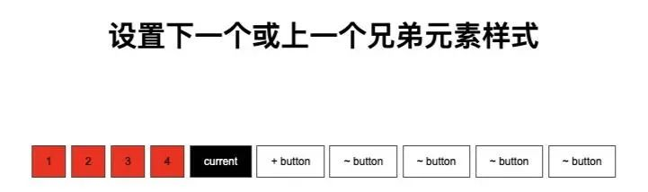

个人觉得 CSS 是每个前端开发人员都必须掌握的基础，以完成相应的交互和终端设备的响应。

在项目开发中，有些容易被忽略的小问题带来项目后期的胶水代码。

本文总结一些项目开发中 css 的 10 个小技巧。

### **1、使用相对单位**

通常我们在项目开发中，使用 px 作为尺寸的单位，而不是使用相对单位，如：rem、em 等。在万物互联的时代，最好的方式是相对单位 rem、vh、vw 等现代 CSS 布局（如 flexbox 和 grid）方式，最大限度的支持各种终端设备。

#### **绝对单位**

px ：是一个绝对单位，主要是因为它是固定的，不会根据任何其他元素的测量而改变。

#### **相对单位**

vw（viewpoint width）：相对于视口的宽度

vh（viewpoint height）：相对于视口的高度

rem（font size of the root element）：相对于根 ( ) 元素 (默认字体大小通常为 16px )

em（font size of the element）：相对于父元素

% ：相对于父元素

```
/* 不提倡 */
```

### **2、代码复用**

很多开发人员在谈到 CSS 时都觉得代码重复性很高，在项目开发中这不是一个好的做法。

好在现在有 CSS 预处理器（sass/scss、less、stylus、Turbine），能够让我们可以更好的规划 CSS 代码，提高其复用性。

当然需要提高代码复用，还是需要一定的 CSS 的基础，来设计好代码结构，如下：

```
/* 不提倡 */
```

### **3、CSS 重置**

每个浏览器都有自己的默认样式，因此，当网页不包含 CSS 时，浏览器会为文本添加一些基本的默认样式、填充、边距等。

可以通过使用通用选择器  \*  重置 padding、margin、box-sizing 和 font-family 来实现这一点。

像这样：

```
* {
```

> 不过这些问题现在基本都被框架解决了，对于初学者建议可以模仿但不建议一开始就上框架。

### **4、不使用颜色名称**

不要使用 red、blue 等颜色名称，相反，建议使用颜色的十六进制值。

为什么呢？因为当使用像 red 这样的颜色名称时，在不同的浏览器或者设备中显示会有所不同。

```
/* 不提倡 */
```

### **5、使用简写属性**

在 CSS 中，多用简写属性，少用单独属性，具体哪些是简写属性，哪些是单独属性，下面列举一下常见的一些属性，是以通常项目为原则。

#### **简写属性**

background、font、 margin、padding、 border、 transition、 transform、 list-style、 border-radius

#### **单独属性**

rotate、scale、background-color、background-image、background-position、padding-left、padding-right、padding-top、padding-bottom、margin-left、margin-top、margin-right、margin-bottom、border-top、 border-right、 border-bottom、 border-left、 border-width、 border-color、 border-style、

```
/* 不提倡 */
```

### **6、文本截取**

在项目开发中，有些列表只需要显示一行文字，有些列表需要显示固定函数的文字，过去通过字符截取的方式来实现，但存在截取不统一（文本内容不同英文、中文、标点符号等），再加上现在各种终端的适配，不足就被放大了。

现在最佳的方式是通过 CSS 来实现，在文本最后增加省略号（...）。

#### **单行截取**

元素必须是 block 或 inline-block，如果溢出被隐藏，则文本溢出不起作用，并且元素必须具有定义的宽度或最大宽度集。

```
p {
```

#### **多行截取**

```
p {
```

### **7、垂直居中**

垂直居中是一个很常见的需求，有很多实现方式，在伸缩容器内的任何东西垂直居中：

```
.flex-vertically-center {
```

inline、inline-block、table-cell 块垂直对齐：

```
img {
```

相对容器中垂直居中的绝对元素，下面代码是.sub-container 在.container 垂直居中：

```
.container {
```

### **8、水平居中**

与垂直对齐类似，不过水平居中更容易一点。

块居中

```
.block-element {
```

内联或内联块文本居中

```
.container {
```

在相对容器内水平居中绝对元素：

```
.container {
```

flex 容器内的任何内容水平居中：

```
.flex-vertically-center {
```

### **9、设置下一个或上一个兄弟元素样式**

对元素前面和后面的元素进行样式设置，在项目开发中很有用。例如 10 个按钮，当前按钮下一个及下一个的兄弟元素设置不同的颜色。

html 代码如下：

```
<div>
```

css 代码：

```
.current ~ button {
```

效果如下：



接下来设置当前按钮前面样式，css 代码如下：

```
button {
```

### **10、宽高比**

如果想让盒子容器有一定的宽高比，如视频播放器尺寸，可以用几种方法来实现，其中有一种方法最直观。可以使用 calc 函数设置顶部填充  (height \* width) / 100%。

如下，创建一个 720px 宽的 16 x 9 矩形：

html 代码：

```
<div class="container">
```

css 代码：

```
.container {
```

还可以使用 after 伪元素来创建比例大小。

```
.box::after {
```

上面的方案会导致里面所有的元素都必须向上移动或需要使用绝对定位。不过好消息是，CSS 增加了 aspect-ratio 属性。

aspect-ratio 为 box 容器规定了一个期待的纵横比，这个纵横比可以用来计算自动尺寸以及为其他布局函数服务。
